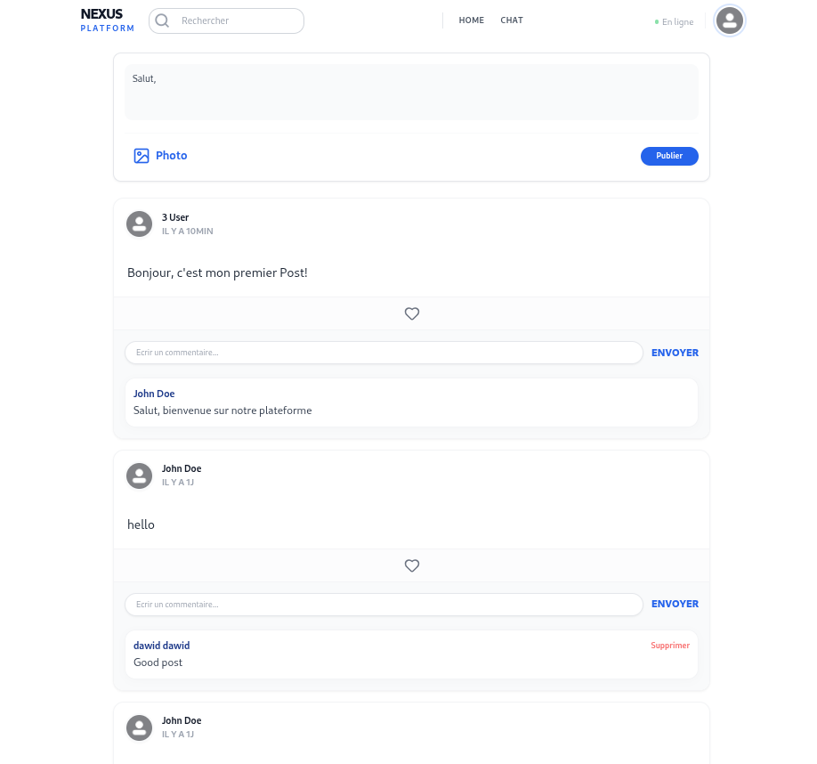
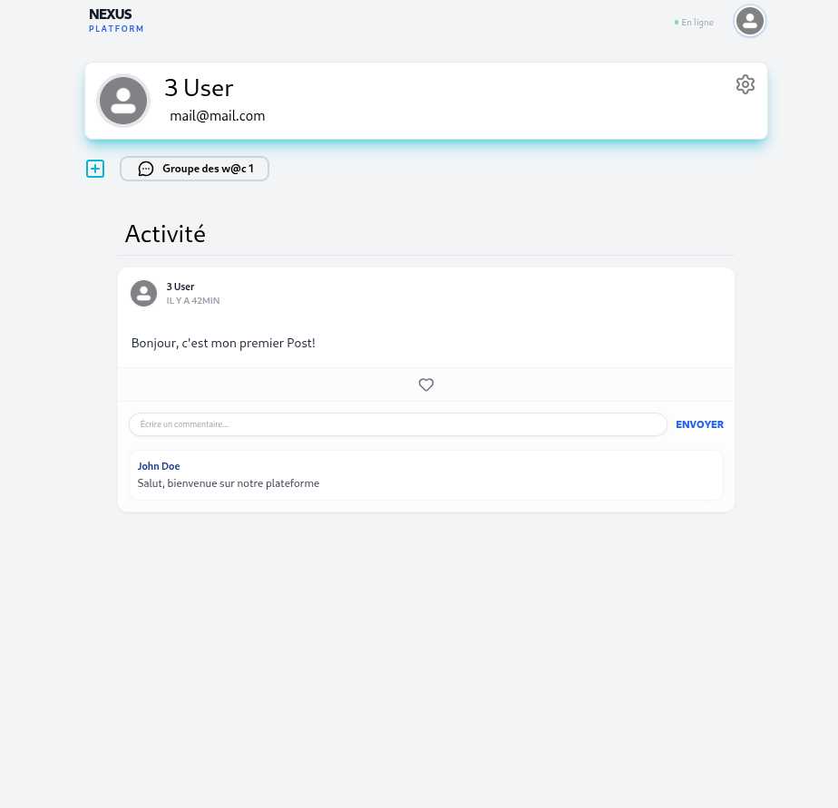

<a id="readme-top"></a>

<br />
<div align="center">
  <h1 align="center">Connect'in</h1>
  <p align="center">
    Une plateforme sociale collaborative pour connecter les utilisateurs et créer des communautés!
    <br />
    <a href="#getting-started"><strong>Démarrer →</strong></a>
    <br />
    <br />
    <a href="https://github.com/yourusername/Connect_in">Voir la démo</a>
    ·
    <a href="https://github.com/yourusername/Connect_in/issues/new?labels=bug&template=bug-report---.md">Signaler un bug</a>
    ·
    <a href="https://github.com/yourusername/Connect_in/issues/new?labels=enhancement&template=feature-request---.md">Demander une feature</a>
  </p>
</div>

<details>
  <summary>Table of Contents</summary>
  <ol>
    <li>
      <a href="#about-the-project">À propos du projet</a>
      <ul>
        <li><a href="#built-with">Technologies utilisées</a></li>
      </ul>
    </li>
    <li>
      <a href="#getting-started">Démarrage rapide</a>
      <ul>
        <li><a href="#prerequisites">Prérequis</a></li>
        <li><a href="#installation">Installation</a></li>
      </ul>
    </li>
    <li><a href="#apercu">Aperçu</a></li>
    <li><a href="#usage">Utilisation</a></li>
    <li><a href="#project-structure">Structure du projet</a></li>
    <li><a href="#api-documentation">Documentation API</a></li>
    <li><a href="#roadmap">Fonctionnalités</a></li>
    <li><a href="#contact">Contact</a></li>
  </ol>
</details>

## À propos du projet

Connect'in est une plateforme sociale complète construite avec un backend robuste en Laravel et un frontend moderne en React. Elle permet aux utilisateurs de créer des profils, partager des posts, créer des groupes, et interagir avec la communauté à travers des commentaires et des "likes".

### Fonctionnalités principales :
* 👥 Gestion des utilisateurs et authentification
* 📝 Création et partage de posts
* 💬 Système de commentaires
* 👍 Système de likes
* 👫 Création et gestion de groupes
* 🔐 Authentification sécurisée avec Sanctum
* 📚 Documentation API complète avec Swagger

<p align="right">(<a href="#readme-top">back to top</a>)</p>

### Technologies utilisées

* [![Laravel][Laravel.com]][Laravel-url] - Backend framework
* [![React][React.js]][React-url] - Frontend library
* [![PHP][PHP.net]][PHP-url] - Server-side language
* [![TailwindCSS][Tailwind.com]][Tailwind-url] - CSS framework
* [![MySQL][MySQL.com]][MySQL-url] - Database

<p align="right">(<a href="#readme-top">back to top</a>)</p>

## Aperçu

### Captures d'écran





<p align="right">(<a href="#readme-top">back to top</a>)</p>

## Démarrage rapide

### Prérequis

Assurez-vous d'avoir installé les éléments suivants :

* **PHP** >= 8.2
  ```sh
  php --version
  ```
* **Composer** (gestionnaire de dépendances PHP)
  ```sh
  composer --version
  ```
* **Node.js** et **npm** >= 18
  ```sh
  node --version
  npm --version
  ```
* **MySQL** >= 8.0 (ou une autre base de données supportée)
  ```sh
  mysql --version
  ```
* **Git**
  ```sh
  git --version
  ```

### Installation

#### 1. Cloner le repository
```sh
git clone https://github.com/lblrs/Connect_in.git
cd Connect_in
```

#### 2. Configuration du Backend (Laravel)

```sh
cd Backend

# Installer les dépendances PHP
composer install

# Créer le fichier .env
cp .env.example .env

# Générer la clé de l'application
php artisan key:generate

# Configurer la base de données dans .env
# DB_CONNECTION=mysql
# DB_HOST=127.0.0.1
# DB_PORT=3306
# DB_DATABASE=connect_in
# DB_USERNAME=root
# DB_PASSWORD=

# Exécuter les migrations
php artisan migrate

# (Optionnel) Remplir la base de données avec des données de test
php artisan db:seed

# Démarrer le serveur Laravel
php artisan serve
```

Le backend sera accessible sur `http://localhost:8000`

#### 3. Configuration du Frontend (React)

```sh
cd ../Frontend/React

# Installer les dépendances
npm install

# Démarrer le serveur de développement
npm start
```

Le frontend sera accessible sur `http://localhost:3000`

<p align="right">(<a href="#readme-top">back to top</a>)</p>

## Utilisation

### Démarrage du projet complet

**Option 1 : Démarrer les deux serveurs dans des terminaux séparés**

Terminal 1 - Backend :
```sh
cd Backend
php artisan serve
```

Terminal 2 - Frontend :
```sh
cd Frontend/React
npm start
```

**Option 2 : Utiliser concurrently (depuis le dossier racine)**
```sh
npm run dev
```

### Accéder à l'application

- **Application Frontend** : http://localhost:3000
- **API Backend** : http://localhost:8000/api
- **Documentation Swagger** : http://localhost:8000/api/documentation

### Exemples d'utilisation

#### Se connecter
1. Créer un compte utilisateur
2. Entrer vos identifiants
3. Accéder à votre tableau de bord

#### Créer un post
1. Aller à la page d'accueil
2. Cliquer sur "Créer un post"
3. Ajouter du contenu et cliquer sur "Publier"

#### Rejoindre un groupe
1. Parcourir la liste des groupes
2. Cliquer sur "Rejoindre" pour un groupe
3. Voir les posts du groupe

<p align="right">(<a href="#readme-top">back to top</a>)</p>

## Structure du projet

```
Connect_in/
├── Backend/                          # API Laravel
│   ├── app/
│   │   ├── Http/Controllers/        # API Controllers
│   │   ├── Models/                  # Eloquent Models
│   │   ├── Policies/                # Authorization Policies
│   │   └── Providers/               # Service Providers
│   ├── database/
│   │   ├── migrations/              # Database Migrations
│   │   ├── factories/               # Model Factories
│   │   └── seeders/                 # Database Seeders
│   ├── routes/
│   │   ├── api.php                  # API Routes
│   │   ├── web.php                  # Web Routes
│   │   └── console.php              # Console Routes
│   ├── config/                      # Configuration Files
│   ├── storage/
│   │   ├── app/                     # Application Files
│   │   ├── logs/                    # Log Files
│   │   └── api-docs/                # Swagger Documentation
│   ├── tests/                       # Unit & Feature Tests
│   ├── composer.json                # PHP Dependencies
│   └── artisan                      # Laravel CLI
├── Frontend/
│   └── React/                       # React Application
│       ├── src/
│       │   ├── components/          # React Components
│       │   ├── pages/               # Page Components
│       │   ├── services/            # API Services
│       │   ├── App.jsx              # Main App Component
│       │   └── index.js             # Entry Point
│       ├── public/                  # Static Files
│       ├── package.json             # JavaScript Dependencies
│       └── README.md                # Frontend Documentation
└── Documentation/                   # Project Documentation
```

<p align="right">(<a href="#readme-top">back to top</a>)</p>

## Documentation API

La documentation complète de l'API est disponible via **Swagger** à l'adresse :

```
http://localhost:8000/api/documentation
```

### Endpoints principaux

#### Utilisateurs
- `POST /api/auth/register` - Créer un compte
- `POST /api/auth/login` - Se connecter
- `GET /api/users/{id}` - Récupérer les infos d'un utilisateur
- `PUT /api/users/{id}` - Mettre à jour le profil

#### Posts
- `GET /api/posts` - Récupérer tous les posts
- `POST /api/posts` - Créer un post
- `GET /api/posts/{id}` - Récupérer un post spécifique
- `PUT /api/posts/{id}` - Mettre à jour un post
- `DELETE /api/posts/{id}` - Supprimer un post

#### Commentaires
- `POST /api/posts/{postId}/comments` - Ajouter un commentaire
- `GET /api/posts/{postId}/comments` - Récupérer les commentaires
- `DELETE /api/comments/{id}` - Supprimer un commentaire

#### Groupes
- `GET /api/groups` - Récupérer tous les groupes
- `POST /api/groups` - Créer un groupe
- `POST /api/groups/{id}/join` - Rejoindre un groupe
- `POST /api/groups/{id}/leave` - Quitter un groupe

<p align="right">(<a href="#readme-top">back to top</a>)</p>

## Fonctionnalités

- [x] Authentification utilisateur
- [x] Système de posts
- [x] Système de commentaires
- [x] Système de likes
- [x] Gestion des groupes

<p align="right">(<a href="#readme-top">back to top</a>)</p>


## Remerciements

* [Best-README-Template](https://github.com/othneildrew/Best-README-Template)
* [Laravel Documentation](https://laravel.com/docs)
* [React Documentation](https://react.dev)
* [Tailwind CSS](https://tailwindcss.com)
* [Swagger/OpenAPI](https://swagger.io)
<p align="right">(<a href="#readme-top">back to top</a>)</p>

---

<!-- MARKDOWN LINKS & IMAGES -->
[Laravel.com]: https://img.shields.io/badge/Laravel-FF2D20?style=for-the-badge&logo=laravel&logoColor=white
[Laravel-url]: https://laravel.com
[React.js]: https://img.shields.io/badge/React-20232A?style=for-the-badge&logo=react&logoColor=61DAFB
[React-url]: https://reactjs.org/
[PHP.net]: https://img.shields.io/badge/PHP-777BB4?style=for-the-badge&logo=php&logoColor=white
[PHP-url]: https://www.php.net
[Tailwind.com]: https://img.shields.io/badge/TailwindCSS-06B6D4?style=for-the-badge&logo=tailwindcss&logoColor=white
[Tailwind-url]: https://tailwindcss.com
[MySQL.com]: https://img.shields.io/badge/MySQL-005C84?style=for-the-badge&logo=mysql&logoColor=white
[MySQL-url]: https://www.mysql.com
[Vite.dev]: https://img.shields.io/badge/Vite-646CFF?style=for-the-badge&logo=vite&logoColor=white
[Vite-url]: https://vitejs.dev
